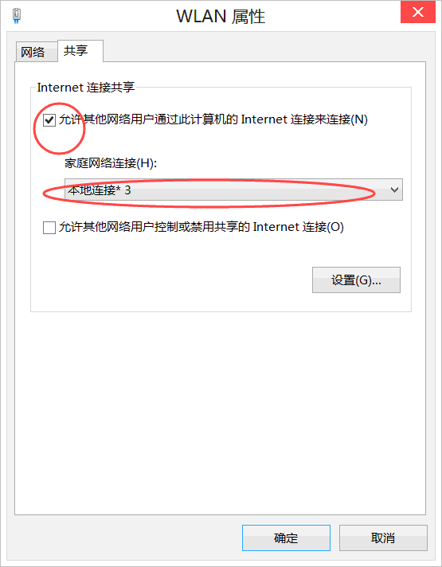
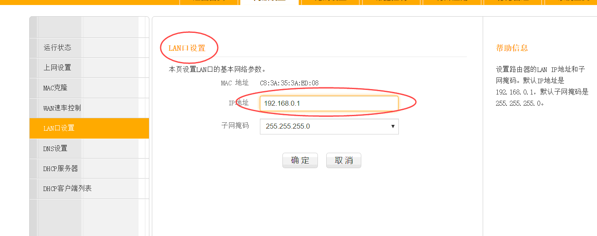

****
使用方法
****

1.	**bat批处理代码前段为打开管理员模式，**
  	**但在windows某些系统下不需要打开，**
  	**则将 :Admin 以上代码注释掉即可(详情见代码)**    
2.	**若出现**

|	
*	**则右击wlan(或以太网)的属性**  

|
+	**将'允许其他网络用户通过此计算机的Internet连接来连接'勾上** 
	 	
+	**并选择创建刚创建的那个连接**
  
  
+	**若出现'无法启动internet连接,为LAN连接配置的IP地址需要使用自动ip寻址'的错误, 是因为你的路由器的界面ip占用了192.168.0.1。**  
+	**只需进入路由器界面**  

   
      
+	**将IP地址改成192.168.1.1即可**
